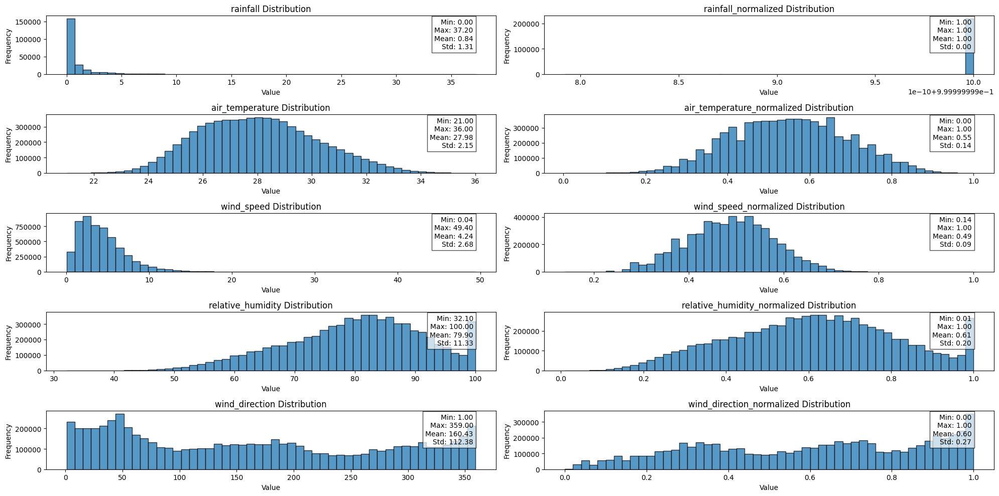
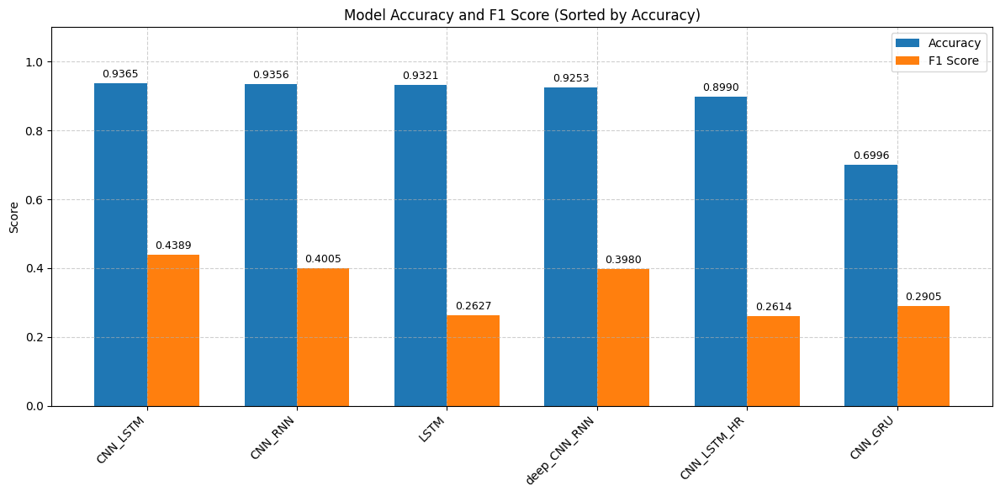

# Group 15: Lightning Risk Prediction 

| Name                         | Student ID |
|------------------------------|------------|
| Chan Wei Jian Ivan           | 1005924    |
| Tom Manuel Opalla Piccio     | 1006293    |
| Deshpande Sunny Nitin        | 1006336    |

## Topic
Our topic focuses on hyper-local inclement weather forecasting (Lightning Risk Warning)

## Application
This project aims to predict Category 1 Lighting Risk Warning (output) in an area to indicate whether outdoor sports activity can resume using weather station data from strategic locations (input).

## Problem Statement
Many Singaporeans enjoy multiple outdoor activities, especially water sports activities including dragon boating, stand-up paddling, canoeing and other water sports. However, these activities are often disrupted by sudden Category 1 Lightning Risk Warnings, which require all outdoor activities to stop immediately. These warnings can be issued without clear visual indicators, as rain and dark clouds do not always precede a Category 1 risk. As a result, participants have little to no time to adjust their plans.
Hence, this project aims to create a model that predicts the Lightning Risk Warning Category a few hours before so people can anticipate whether their activity can continue and whether they should travel towards the area. It should also be able to predict whether they can expect to get more water time a few minutes ahead.
Target Location: PAssion WaVe @ Bedok Reservoir (16S)
This location was chosen because it is one of the water sports centres that is geographically well-covered by surrounding weather stations.

## Input Data

## Imports & Dependencies

This project uses the following Python libraries:

- **PyTorch** (`torch`): For building and training neural networks.
  - `torch.nn`, `torch.nn.functional`: Layers and functions for model architecture.
  - `torch.utils.data`: For dataset handling, splitting, and data loading.
- **Pandas** (`pandas`): For reading and manipulating tabular data.
- **NumPy** (`numpy`): For numerical operations and array manipulation.
- **Matplotlib** (`matplotlib.pyplot`): For plotting and visualisation.
- **Datetime** (`datetime`): For timestamp handling and formatting.
- **pytz**: For timezone-aware datetime processing.
- **sklearn.metrics**:
  - `precision_score`, `recall_score`, `f1_score`: For evaluating classification performance.
- **OS & Sys** (`os`, `sys`): For file system navigation and environment configuration.
- **glob**: For matching file patterns in directory structures.
- **re**: For regular expression operations.
- **torch.utils.data.ConcatDataset**, **TensorDataset**: For combining and wrapping datasets.

## Results
We designed multiple deep learning architectures, including LSTM, CNN_RNN, CNN_LSTM, and CNN_GRU, each combining spatial and temporal feature extraction in different configurations. The different models are tested on the new dataset from March 2025 to 15 April 2025.

> Each model are located in each main folder (unless the model is too big). Run the main.ipynb to see how each model perform.

